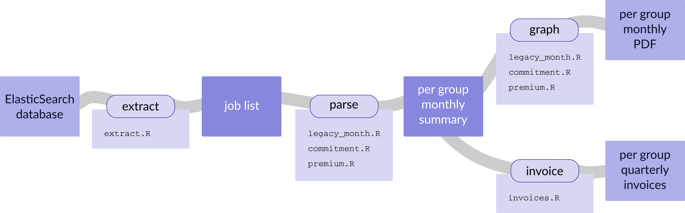
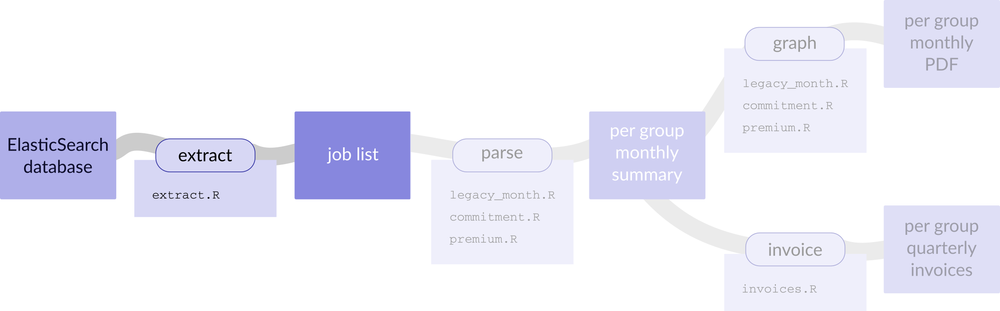
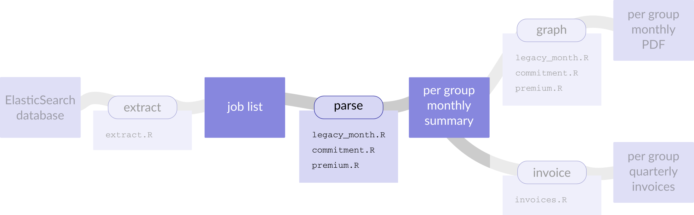
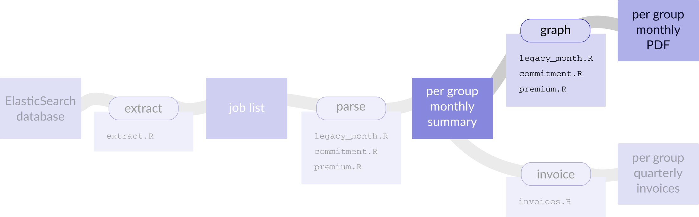
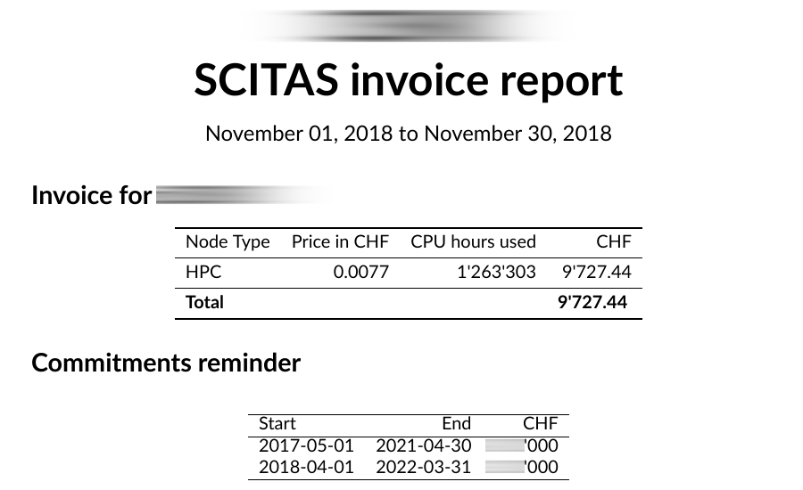
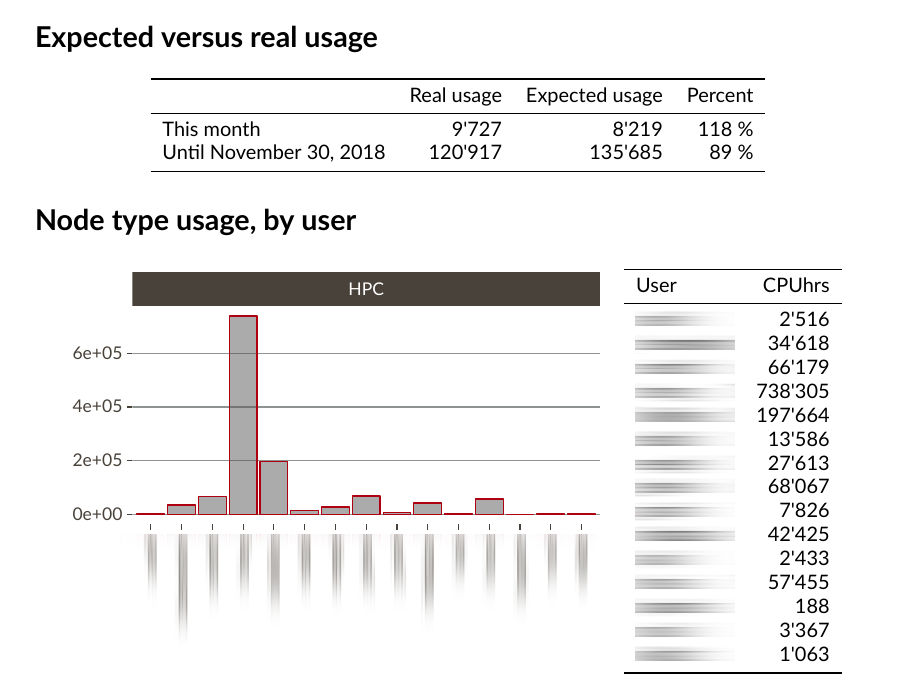
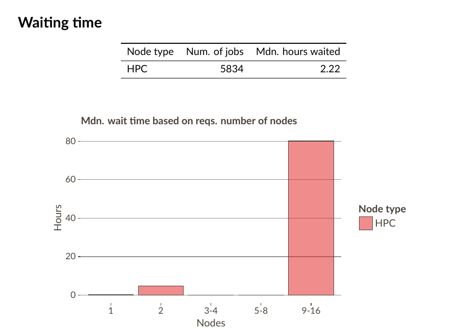
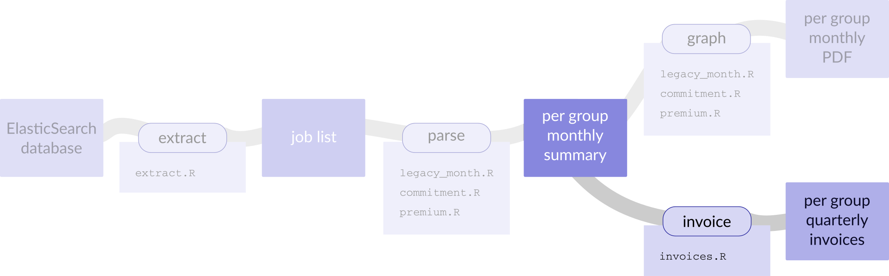

<style>
.reveal section img { background:none; border:none; box-shadow:none; }
.reveal section table {
  border: none;
}
</style>


# Who am I

# What is SCITAS

# SCITAS type of users

---

## free

---

## premium

---

## commitment

---

## legacy

---

# Why R

<div class="fragment" data-fragment-index="1">
beautiful graphs, powerful graphical engine (ggplot2)
</div>


# Why R

intuitive language (at least, for me)


# Why R

we need to do statistics, we use appropriate tools

# Why R

I wanted LaTeX: knitr

# Why R

it's Free and Open Source Software


# Invoicing

## Architecture of the system



---

## Extract




<div class="fragment" data-fragment-index="1">
connects to the ElasticSearch
</div>
<div class="fragment" data-fragment-index="2">
dumps data about all jobs in a text file
</div>

---

<pre><code>query@scitassrv2:~/scitas-stats/data♥ wc -l jobs_??18.txt
   125745 jobs_0118.txt
   208919 jobs_0218.txt
   243342 jobs_0318.txt
   536520 jobs_0418.txt
   234345 jobs_0518.txt
   829662 jobs_0618.txt
   202575 jobs_0718.txt
   381770 jobs_0818.txt
   260181 jobs_0918.txt
   427098 jobs_1018.txt
   373677 jobs_1118.txt
  3823834 total
</code></pre>

---

<pre><code>query@scitassrv2:~/scitas-stats/data♥ head -16  jobs_1118.txt 
Cluster|Partition|JobIDRaw|User|Account|Start|End|Submit|NCPUS|NNodes|ReqMem|NodeList|ReqGRES|LevelFS|Timelimit|ReqCPUS
fidis|parallel|1346484|user1|lab1|2018-11-28T09:44:44|2018-11-28T09:45:59|2018-11-28T09:44:44|9|1|4096|f137|(null)|1.557204|NA|NA
fidis|parallel|1353745|user1|lab1|2018-11-29T18:09:30|2018-11-30T00:47:39|2018-11-29T18:09:30|9|1|4096|g207|(null)|0.975728|NA|NA
fidis|parallel|1343107|user1|lab1|2018-11-26T16:19:18|2018-11-26T21:20:17|2018-11-26T16:19:16|9|1|4096|f339|(null)|12.301852|NA|NA
fidis|parallel|1348562|user1|lab1|2018-11-28T10:18:04|2018-11-28T16:12:32|2018-11-28T10:16:54|9|1|4096|f096|(null)|1.533328|NA|NA
fidis|parallel|1353764|user1|lab1|2018-11-29T18:11:02|2018-11-30T00:49:53|2018-11-29T18:10:53|9|1|4096|g178|(null)|0.972803|NA|NA
fidis|parallel|1353739|user1|lab1|2018-11-29T18:09:03|2018-11-30T00:43:35|2018-11-29T18:09:03|9|1|4096|g082|(null)|0.975728|NA|NA
fidis|parallel|1313538|user2|lab2|2018-11-12T17:20:19|2018-11-12T17:20:54|2018-11-12T17:20:16|28|1|4096|g047|(null)|6.56051|NA|NA
fidis|parallel|1337796|user3|lab3|2018-11-22T19:57:42|2018-11-23T07:57:56|2018-11-22T17:48:32|56|2|4096|f[198,351]|(null)|0.754477|NA|NA
fidis|parallel|1337793|user3|lab3|2018-11-22T18:19:40|2018-11-23T06:19:56|2018-11-22T17:47:55|56|2|4096|f[025,036]|(null)|0.754266|NA|NA
fidis|parallel|1337627|user3|lab3|2018-11-22T17:02:33|2018-11-23T05:02:56|2018-11-22T16:38:43|56|2|4096|f[132,138]|(null)|0.75273|NA|NA
fidis|parallel|1337676|user3|lab3|2018-11-22T17:37:15|2018-11-23T05:37:26|2018-11-22T17:08:35|56|2|4096|f[008,013]|(null)|0.75352|NA|NA
fidis|parallel|1336932|user3|lab3|2018-11-22T13:33:17|2018-11-22T13:33:21|2018-11-22T13:32:00|56|2|4096|f[041,158]|(null)|0.748876|NA|NA
fidis|parallel|1336933|user3|lab3|2018-11-22T13:33:17|2018-11-22T13:33:20|2018-11-22T13:32:00|56|2|4096|f[228,262]|(null)|0.748876|NA|NA
fidis|parallel|1337672|user3|lab3|2018-11-22T17:09:02|2018-11-23T05:09:26|2018-11-22T17:08:26|56|2|4096|f[122,171]|(null)|0.752824|NA|NA</code></pre>

---


## Extract

- if too many jobs: crash
- RAM intensive
- can run for long

---

## Extract

- result complete and human readable
- nice for archiving
- compliance

---

# I ♥ library(elastic)

---

## Parse





<div class="fragment" data-fragment-index="1">
for each account type
</div>

<div class="fragment" data-fragment-index="2">
for each group
</div>

<div class="fragment" data-fragment-index="3">
creates summary
</div>


---


<pre><code>Cluster|Partition|JobIDRaw|User|Account|Start|End|Submit|NCPUS|NNodes|ReqMem|NodeList|ReqGRES|LevelFS|Timelimit|ReqCPUS
fidis|parallel|1346484|user1|lab1|2018-11-28T09:44:44|2018-11-28T09:45:59|2018-11-28T09:44:44|9|1|4096|f137|(null)|1.557204|NA|NA
fidis|parallel|1353745|user1|lab1|2018-11-29T18:09:30|2018-11-30T00:47:39|2018-11-29T18:09:30|9|1|4096|g207|(null)|0.975728|NA|NA
fidis|parallel|1343107|user1|lab1|2018-11-26T16:19:18|2018-11-26T21:20:17|2018-11-26T16:19:16|9|1|4096|f339|(null)|12.301852|NA|NA
fidis|parallel|1348562|user1|lab1|2018-11-28T10:18:04|2018-11-28T16:12:32|2018-11-28T10:16:54|9|1|4096|f096|(null)|1.533328|NA|NA
fidis|parallel|1353764|user1|lab1|2018-11-29T18:11:02|2018-11-30T00:49:53|2018-11-29T18:10:53|9|1|4096|g178|(null)|0.972803|NA|NA
fidis|parallel|1353739|user1|lab1|2018-11-29T18:09:03|2018-11-30T00:43:35|2018-11-29T18:09:03|9|1|4096|g082|(null)|0.975728|NA|NA
fidis|parallel|1313538|user2|lab2|2018-11-12T17:20:19|2018-11-12T17:20:54|2018-11-12T17:20:16|28|1|4096|g047|(null)|6.56051|NA|NA
fidis|parallel|1337796|user3|lab3|2018-11-22T19:57:42|2018-11-23T07:57:56|2018-11-22T17:48:32|56|2|4096|f[198,351]|(null)|0.754477|NA|NA
fidis|parallel|1337793|user3|lab3|2018-11-22T18:19:40|2018-11-23T06:19:56|2018-11-22T17:47:55|56|2|4096|f[025,036]|(null)|0.754266|NA|NA
fidis|parallel|1337627|user3|lab3|2018-11-22T17:02:33|2018-11-23T05:02:56|2018-11-22T16:38:43|56|2|4096|f[132,138]|(null)|0.75273|NA|NA
fidis|parallel|1337676|user3|lab3|2018-11-22T17:37:15|2018-11-23T05:37:26|2018-11-22T17:08:35|56|2|4096|f[008,013]|(null)|0.75352|NA|NA
fidis|parallel|1336932|user3|lab3|2018-11-22T13:33:17|2018-11-22T13:33:21|2018-11-22T13:32:00|56|2|4096|f[041,158]|(null)|0.748876|NA|NA
fidis|parallel|1336933|user3|lab3|2018-11-22T13:33:17|2018-11-22T13:33:20|2018-11-22T13:32:00|56|2|4096|f[228,262]|(null)|0.748876|NA|NA
fidis|parallel|1337672|user3|lab3|2018-11-22T17:09:02|2018-11-23T05:09:26|2018-11-22T17:08:26|56|2|4096|f[122,171]|(null)|0.752824|NA|NA</code></pre>

---


```{r parse,  eval=F}
load("commitment_lab1_181101-181130.RData")
ls()
```

<pre><code>##  [1] &quot;commitments.df&quot; &quot;daterange&quot;      &quot;end&quot;            &quot;groupname&quot;
##  [5] &quot;gtot&quot;           &quot;imagefile&quot;      &quot;mapalpha&quot;       &quot;nodeusage&quot;
##  [9] &quot;prices&quot;         &quot;replaceT&quot;       &quot;start&quot;          &quot;totalcost&quot;
## [13] &quot;userusage&quot;      &quot;waittime&quot;</code></pre>
<div class="sourceCode"><pre class="sourceCode r"><code class="sourceCode r">userusage</code></pre></div>
<pre><code>##       User Node Type  Price CPU hours used
## 1    user1       HPC 0.0077   5.444444e-02
## 2    user2       HPC 0.0077   1.165049e+03
## 3    user3       HPC 0.0077   2.907140e+04</code></pre>
<div class="sourceCode"><pre class="sourceCode r"><code class="sourceCode r">nodeusage</code></pre></div>
<pre><code>##   Node Type  Price CPU hours used      CHF
## 1       HPC 0.0077        30236.5 232.8211</code></pre>


---

## Parse

Extra work for commitment

Need to retrieve information on all commitments

---

## Graph





<div class="fragment" data-fragment-index="1">
takes the info in the RDatas and displays it
</div>

---



---



---



---

# I ♥ library(tikzDevice)
# I ♥ library(ggplot2)
# I ♥ library(knitr)
# I ♥ xelatex

---

## Invoices





<div class="fragment" data-fragment-index="1">
Produces an Excel sheet with the "quarterly" totals
</div>

---

all of this is done automatically (ahem)<br>during the night of the first day of each month

---

## Pros

- Readable code, easy to take over
- Integration with LaTeX
- Integration with ElasticSearch
- We could do invoicing with no human interaction

---

## Cons

- Still some issues to iron out
- Do we really need to store all the info about the jobs?
- Automation still a bit theoretical
- SCITAS staff are mostly Python people

---

---

# Bonus slide

## Other cool stuff I do with R

- this reveal.js presentation entirely made with R
- [could be also shown via mybinder.org](https://mybinder.org/v2/gh/rezzonic/r-ladies-scitas/master?urlpath=rstudio)
- apps with Shiny
